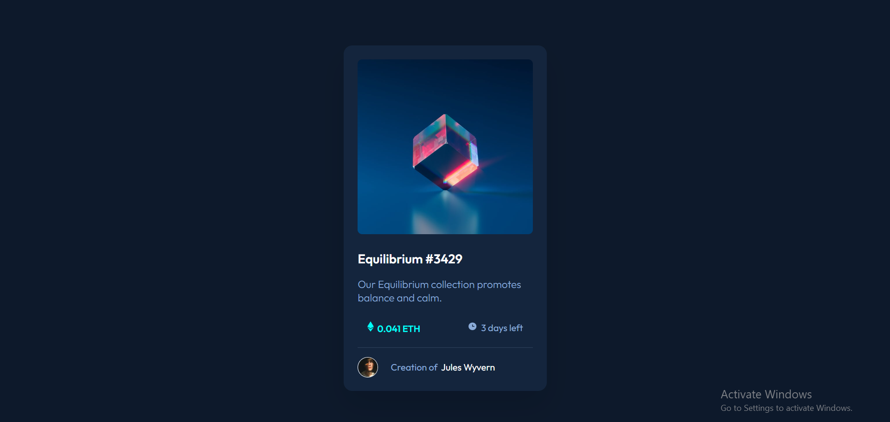

# Frontend Mentor - NFT preview card component solution

This is a solution to the [NFT preview card component challenge on Frontend Mentor](https://www.frontendmentor.io/challenges/nft-preview-card-component-SbdUL_w0U). Frontend Mentor challenges help you improve your coding skills by building realistic projects. 

## Table of contents

- [Overview](#overview)
  - [The challenge](#the-challenge)
  - [Screenshot](#screenshot)
  - [Links](#links)
- [My process](#my-process)
  - [Built with](#built-with)
  - [What I learned](#what-i-learned)
- [Acknowledgments](#acknowledgments)

## Overview

### The challenge

Users should be able to:

- View the optimal layout depending on their device's screen size
- See hover states for interactive elements

### Screenshot

### Links

- Solution URL: [https://github.com/gabadadzeluca/nft-preview-card-component]()
- Live Site URL: [https://gabadadzeluca.github.io/nft-preview-card-component]()

## My process

### Built with

- Semantic HTML5 markup
- CSS custom properties
- Flex property

### What I learned

I learned using display: flex, justify-content,align-items, wrap properties. I'm able to use display flex now. I understood the difference between inline and inline-block elements.

### Continued development

I wasn't able to add hover function withour using position: absolute. Which I think isn't a best way to add image-overlay.

